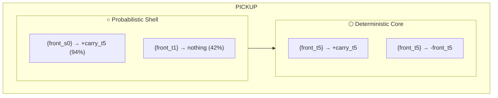

# Rule Hierarchy: The Elegant Core

## The Structure

```
┌─────────────────────────────────────────────────────────────────────────┐
│                    EXTERIOR: Full-Context Rules                         │
│    (Specific to exact states, thousands of rules)                       │
│  ┌───────────────────────────────────────────────────────────────────┐  │
│  │                LAYER 2: Conditional Laws                          │  │
│  │    Multi-token deterministic rules (34 rules)                     │  │
│  │  ┌─────────────────────────────────────────────────────────────┐  │  │
│  │  │              LAYER 1: Probabilistic Axioms                  │  │  │
│  │  │    Single/double-token base rates (1,233 rules)             │  │  │
│  │  │  ┌───────────────────────────────────────────────────────┐  │  │  │
│  │  │  │            CORE: Deterministic Laws                   │  │  │  │
│  │  │  │    Single-token universal truths (507 rules)          │  │  │  │
│  │  │  │                                                       │  │  │  │
│  │  │  │    Example: {front_t5} → +carry_t5 (100%)             │  │  │  │
│  │  │  │             "If key in front, pickup gets key"        │  │  │  │
│  │  │  └───────────────────────────────────────────────────────┘  │  │  │
│  │  └─────────────────────────────────────────────────────────────┘  │  │
│  └───────────────────────────────────────────────────────────────────┘  │
└─────────────────────────────────────────────────────────────────────────┘
```

## The Elegant Core: PICKUP Action

The **pickup** action demonstrates the hierarchy perfectly:

### Deterministic Core (innermost)
```
{front_t5} + pickup → +carry_t5      (100%, n=739)
{front_t5} + pickup → +carry_c4      (100%, n=739)
{front_t5} + pickup → +front_t1      (100%, n=739)
{front_t5} + pickup → -carry_none    (100%, n=739)
{front_t5} + pickup → -front_t5      (100%, n=739)
{front_t5} + pickup → -see_t5_adj    (100%, n=739)
```

**Interpretation**: "If there's a type-5 object (key) in front, pickup ALWAYS works"

### Probabilistic Shell (surrounding)
```
{front_s0} + pickup → +carry_t5      (94%, n=...)
{front_t1} + pickup → +carry_none    (42%, n=...)
```

**Interpretation**: 
- "If front cell has state 0, pickup usually (94%) gets a key"
- "If front is empty, pickup sometimes (42%) does nothing"

### Why This Matters

The **deterministic core** gives us the **laws** - things that ALWAYS happen.
The **probabilistic shell** gives us the **expectations** - things that USUALLY happen.

When predicting:
1. Check if a deterministic rule applies → guaranteed outcome
2. Otherwise use probabilistic rules → expected outcome

## Key Discoveries (from raw numbers only!)

### Action: PICKUP (a3)
| Layer | Pattern | Effect | Probability |
|-------|---------|--------|-------------|
| CORE | {front_t5} | +carry_t5 | 100% |
| SHELL | {front_s0} | +carry_t5 | 94% |

The system discovered: **t5 = key**, **pickup + key = carrying key**

### Action: DROP (a4)
| Layer | Pattern | Effect | Probability |
|-------|---------|--------|-------------|
| COND | {carry_t5, front_t1} | +carry_none | 100% |
| SHELL | {front_t1} | +carry_none | 42% |

The system discovered: **carrying key + empty front = can drop**

### Action: TOGGLE (a5)
| Layer | Pattern | Effect | Probability |
|-------|---------|--------|-------------|
| CORE | {door_s2} | +door_s0 | 3% |
| COND | {carry_t5, door_s2, front_t4} | +door_s0 | ~100% |

The system discovered: **toggle locked door (s2) with key (t5) = open (s0)**

## Statistics

| Category | Count | Description |
|----------|-------|-------------|
| Deterministic Laws | 507 | Single-token, 100% reliable |
| Conditional Laws | 34 | Multi-token deterministic |
| Probabilistic Axioms | 1,233 | Base rates and expectations |
| **Total Core** | **1,774** | All minimal rules |
| Full Rule Set | 3,849 | All stable rules |
| **Compression** | **46%** | Core captures half the rules |

## The Philosophy

The hierarchy reveals:

1. **Laws are simple**: The most reliable rules have the smallest patterns
2. **Complexity adds specificity**: Larger patterns handle edge cases
3. **Probability bridges gaps**: When no deterministic rule applies, expectations guide

This mirrors how humans understand the world:
- "Fire burns" (simple law)
- "Fire burns IF you touch it AND it's hot" (conditional)
- "Things usually fall down" (probabilistic expectation)

## Mermaid Diagram: PICKUP



## Files

- `hierarchical_learner.py` - Main implementation
- `elegant_core.py` - Hierarchy analysis
- `rule_lattice.py` - Lattice structure
